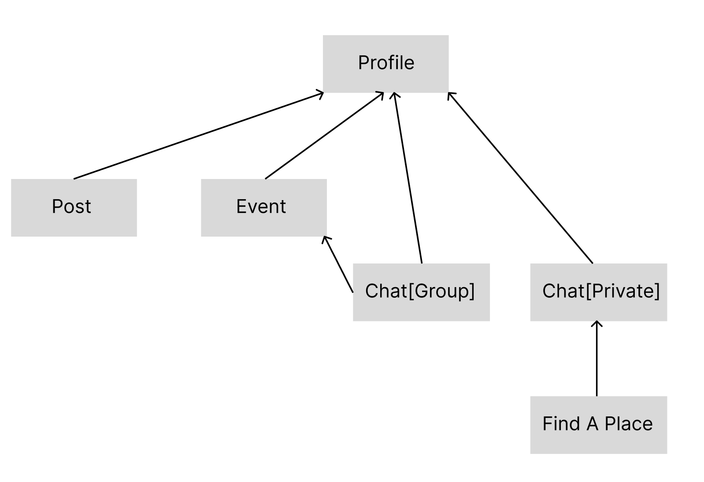

# Pitch

**Banana Foundry** is a co-founder and entrepreneurial matching app designed primarily for the MIT and Harvard community, including students, alumni, and affiliates. Inspired by the spirit of the MIT Banana Lounge—where students gather to work on challenging problems, exchange ideas, and, of course, enjoy bananas—Banana Foundry aims to foster a collaborative environment for aspiring entrepreneurs, experienced founders, and innovation enthusiasts.

The app offers detailed user profiles that showcase each individual’s skills, interests, and entrepreneurial journey, allowing others to assess potential collaborations at a glance. Users can create posts to share updates, seek advice, or express their needs for co-founders or team members. The platform collects relevant events to provide opportunities to attend local entrepreneurship gatherings, while chats enable users to engage in one-on-one or group discussions. To facilitate in-person connections, the Find a Place feature encourages seamless coordination of meetings at nearby locations.

Banana Foundry is all about turning great ideas into impactful ventures by connecting people with the right skills, insights, and local opportunities—just like the Banana Lounge, but reimagined as a digital community for entrepreneurship.

# Functional Design Concepts for Banana Foundry

## 1. Profile [User]
- **Purpose**: Represent each user's entrepreneurial background, experience, and personal information.
- **Principle**: A profile is created by every user upon registration. After creation, it can be viewed and updated, providing comprehensive information that helps others assess potential collaborations.
- **State**:
  - `users: set User`
  - `profiles: set Profile`
  - `profileInfo: users → one ProfileInfo`
  - `ProfileInfo = (Name, Expertise, Interests, PastExperience, VerificationStatus, Gender)`
  - `followers: users → set User` (Represents the users who follow a specific user)
  - `following: users → set User` (Represents the users a specific user is following)
  - `userPosts: users → set Post` (Represents the posts created by a specific user)
- **Actions**:
  - `registerUser (u: User, out p: Profile)`: `u` is added to `users`, creating a new Profile `p`.
  - `editProfile (u: User, newInfo: ProfileInfo)`: `profileInfo(u)` is updated with `newInfo`.
  - `verifyProfile (u: User)`: `profileInfo(u).VerificationStatus := verified`
  - `viewProfile (viewer: User, viewee: User)`: Outputs `profileInfo(viewee)` if `viewer` has appropriate permissions.
  - `followUser (follower: User, target: User)`: `followers(target) += follower`.
  - `viewUserPosts (viewer: User, viewee: User, out posts: set Post)`: Outputs `userPosts(viewee)` if `viewer` has appropriate permissions.
  - `viewFollowingCount (u: User, out count: Integer)`: Outputs the count of `following(u)`.
  - `viewFollowersCount (u: User, out count: Integer)`: Outputs the count of `followers(u)`.

## 2. Post [Content]
- **Purpose**: Users share ideas, updates, or needs related to their entrepreneurial projects, and interact through comments.
- **Principle**: Posts can be made to express project updates, ask for feedback, or seek collaborators. Each post is tied to a specific user profile and allows others to comment.
- **State**:
  - `posts: set Post`
  - `content: posts → one Content`
  - `postState: posts → one State`
  - `State ∈ {LookingForPeople, GeneralDiscussion}`
  - `tags: posts → set Tag`
  - `likes: posts → set User`
  - `comments: posts → set Comment`
  - `Comment = (author: User, text: String, timestamp: DateTime)`
- **Actions**:
  - `createPost (u: User, c: Content, s: State, t: set Tag, out p: Post)`: `p` is added to `posts`, with `content(p) := c`, `postState(p) := s`, `tags(p) := t`, `likes(p) := ∅`, and `comments(p) := ∅`.
  - `editPost (p: Post, newContent: Content)`: `content(p)` is updated with `newContent`.
  - `deletePost (p: Post)`: `p` is removed from `posts`.
  - `reactToPost (u: User, p: Post)`: `likes(p) += u`.
  - `addComment (u: User, p: Post, commentText: String, out c: Comment)`: Adds a comment `c` to `comments(p)`.

## 3. Event [Platform Managed Activity]
- **Purpose**: Facilitate user participation in platform-organized events.
- **Principle**: Events are created and updated by the platform administrators only, helping users to connect in-person or online through curated activities. Users can only register and interact with other participants.
- **State**:
  - `events: set Event`
  - `eventDetails: events → one EventInfo`
  - `registeredUsers: events → set User`
  - `EventInfo = (Description, Time, Location)`
- **Actions**:
  - `registerForEvent (u: User, e: Event)`: `registeredUsers(e) += u`.
  - `viewEvents (u: User, out e: set Event)`: Provides the list of events available for registration.

## 4. Chat [Messaging]
- **Purpose**: Enable communication among users through private or group messaging.
- **Principle**: Users can initiate private or group chats for collaboration or event-related discussions. Only users who follow each other can start a chat without restrictions, while users who aren't followed back can only send one message unless there is a response.
- **State**:
  - `chats: set Chat`
  - `chatType: chats → one Type`
  - `Type ∈ {Private, Group}`
  - `participants: chats → set User`
  - `messages: chats → list Message`
  - `initialMessageSent: users × users → Boolean` (Records if a user has already sent a message to a non-follower)
- **Actions**:
  - `startPrivateChat (u1: User, u2: User, out c: Chat)`:
    - If `u2 ∈ followers(u1)`, a new `Chat` `c` is added to `chats` with `chatType(c) := Private` and `participants(c) := {u1, u2}`.
    - If `u2 ∉ followers(u1)` and `initialMessageSent(u1, u2) = false`, a new `Chat` `c` is added to `chats`, and `initialMessageSent(u1, u2) := true`.
  - `sendMessage (u: User, c: Chat, msg: Message)`:
    - If `chatType(c) = Private` and `u2 ∉ followers(u1)` and `initialMessageSent(u1, u2) = true`, further messages are restricted until a response is received.
    - Otherwise, `messages(c)` is appended with `msg`.
  - `startGroupChat (users: set User, out c: Chat)`: A new `Chat` `c` is added to `chats` with `chatType(c) := Group` and `participants(c) := users`.
  - `leaveChat (u: User, c: Chat)`: If `u ∈ participants(c)`, `participants(c) -= u`.

## 5. Find a Place [MeetingLocation]
- **Purpose**: Assist users in private chat to find suitable locations for in-person meetings by browsing nearby spots and agreeing on a time.
- **Principle**: Users propose a meeting location and time in a private chat, and the recipient can choose to respond with acceptance by clicking "Going."
- **State**:
  - `locations: set Location` (All possible meeting locations)
  - `proposedMeetings: set Meeting`
  - `Meeting = (proposer: User, recipient: User, location: Location, proposedTime: DateTime, status: Status)`
  - `Status ∈ {Pending, Accepted}`
- **Actions**:
  - `browseNearbyLocations (user: User, out locs: set Location)`: Provides a list `locs` of nearby meeting locations based on the user's current location.
  - `proposeMeeting (proposer: User, recipient: User, loc: Location, time: DateTime, out m: Meeting)`: Adds a new Meeting proposal `m` with status set to `Pending`.
  - `acceptMeeting (recipient: User, m: Meeting)`: Updates `m.status` to `Accepted` if `recipient` is the intended recipient of the proposed meeting.

# Synchronized Actions

## 1. User Registration and Profile Setup
- **sync registerUser (name: String, gender: String, expertise: String, interests: String, out p: Profile)**:
  - `Profile.registerUser`
  - `Profile.editProfile` (ProfileInfo updated with Name, Gender, Expertise, Interests)

## 2. Follow a User and Start Chat
- **sync followUser (follower: User, target: User)**:
  - `Profile.followUser (follower, target)`
  - `Chat.startPrivateChat (follower, target, out c: Chat)`

## 3. Create and React to a Post
- **sync createPost (user: User, content: Content, state: State, tags: set Tag, out p: Post)**:
  - `Post.createPost (user, content, state, tags, out p: Post)`
- **sync reactToPost (user: User, post: Post)**:
  - `Post.reactToPost (user, post)`

## 4. Add a Comment to a Post
- **sync addComment (user: User, post: Post, commentText: String, out c: Comment)**:
  - `Post.addComment (user, post, commentText, out c: Comment)`

## 5. Browse Nearby Locations and Propose a Meeting in Private Chat
- **sync proposeMeetingLocation (proposer: User, recipient: User, out locs: set Location, selectedLoc: Location, time: DateTime, out m: Meeting)**:
  - `Find a Place.browseNearbyLocations`
  - `Find a Place.proposeMeeting`
- **sync respondToMeeting (recipient: User, meeting: Meeting, response: Response)**:
  - `Find a Place.acceptMeeting`

# Dependency Diagram for Concepts
  
*Dependency Diagram for Concepts*

- **Profile**: Profile is the foundational concept required for all other features.
- **Profile → Post**: Users must have a profile to create or interact with posts.
- **Profile → Event**: Users need a profile to register for platform-managed events.
- **Profile → Private Chat**: Users need a profile to initiate or receive private chat invitations; Private chat interaction is restricted by the follow relationship.
- **Profile → Group Chat**: Users need a profile to join or start group chats.
- **Event → Group Chat**: Events include group chats where participants can communicate.
- **Private Chat → Find a Place**: Find a Place is accessible only in private chats to propose in-person meetings.

# Subset Examples
## Profile-Only Subset
### 1. Basic Profile Management: `{Profile}`
- Users can register and manage their profiles.
## Content and Sharing Subsets
### 2. Content Creation and Sharing: `{Profile, Post}`
- Users can create posts, interact with content, and comment.

### 3. Event Participation: `{Profile, Event}`
- Users can browse and register for events.

### 4. Event Participation with Group Communication: `{Profile, Event, Group Chat}`
- Users can communicate in event-related group chats to foster collaboration.

## Private Interaction Subsets
### 5. Private Interactions: `{Profile, Private Chat}`
- Users can follow each other and initiate private chats. The chat is unrestricted if both users follow each other.

### 6. Private Interaction with In-Person Meeting Coordination: `{Profile, Private Chat, Find a Place}`
- Users can use the Find a Place feature within private chats to coordinate in-person meetings.

# Wireframes
- [Figma Wireframes](https://www.figma.com/design/g15D0HvAdx3kyq1VYPgQpN/6.1040-Assignment3?node-id=7-50&t=zkMeO4bmgWEBmRq2-1)

# Design Tradeoffs
## 1. Policy on Private Chat
- **Options**: Allow unrestricted private chats, require mutual following, or allow one initial message without mutual following.
- **Chosen Option**: Require mutual following but allow one initial message if the other party hasn’t followed back.
- **Rationale**: This approach strikes a balance between accessibility and user privacy, allowing users to express interest while preventing spam. Mutual following helps ensure users only have meaningful interactions with those genuinely interested in collaboration.

## 2. Platform-Managed Events vs. User-Created Events
- **Options**: Allow users to create events or restrict event posting to platform administrators.
- **Chosen Option**: All events are collected and posted by the platform.
- **Rationale**: This approach ensures high-quality, curated events that align with the platform's goals of fostering meaningful in-person connections, insightful discussions, and a cohesive entrepreneurial community. Allowing user-created events at an early stage could introduce too much variability, potentially leading to inconsistent quality and a diluted focus, which might detract from the platform's core mission.

## 3. "Looking for People" vs. "Looking for Co-Founder"
- **Options**: Use a general post category like "Looking for People" or a more specific category like "Looking for Co-Founder."
- **Chosen Option**: Use "Looking for People" as the broader category.
- **Rationale**: While "Looking for Co-Founder" is more specific and directly applicable to many users, it could limit the scope of collaboration. "Looking for People" accommodates a wider range of needs—whether a user is searching for co-founders, team members, advisors, collaborators, or even test users for their products. This flexibility encourages more interactions and opens opportunities for a variety of connections within the ecosystem.
